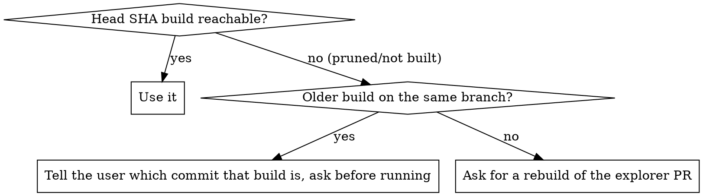

# Validate Paired PRs

Two PRs, one run: the **automation** PR supplies the tests, the **explorer** PR supplies the client.

The automatic `InWorld (PR)` workflow cannot do this — it hardcodes `build_url: ''`
(`inworld-pr.yml:190`) and always resolves the newest unity-explorer
**dev** build. The only lever is a `workflow_dispatch` of **InWorld Suite** (`run-inworld-suite.yml`) on the
automation PR's branch, with both artifact URLs supplied.

Dispatching on the branch is what makes the PR's tests run: `tests_ref` is not a dispatch input, so both legs
check out `github.sha` — the tip of the dispatched ref (`run-inworld-suite.yml:328`,
`windows-inworld-custom-image.yml:269`).

## Collect first

| Need | Where from |
| --- | --- |
| automation PR head branch | `gh pr view <automation_pr> --json headRefName` |
| explorer PR head branch + head SHA | `gh pr view <explorer_pr> --repo decentraland/unity-explorer --json headRefName,headRefOid` |
| filter | the latest `InWorld suite` comment on the automation PR quotes the one its own run used; otherwise `Category=InWorld` |

Given only one PR, ask for the other. Never silently substitute `main` or a dev build — a run that tested
something other than the two things named is worse than no run.

## 1. Resolve both build URLs

The unity-explorer PR's build comment already carries both links. When it doesn't, walk the branch's builds:

```bash
EXP_PR=9817
set -- $(gh api repos/decentraland/unity-explorer/pulls/$EXP_PR --jq '"\(.head.ref) \(.head.sha[0:7])"')
BR=$1; HEAD_SHA=$2
case "$BR" in ''|*[!A-Za-z0-9._/-]*) echo "PR $EXP_PR not found on unity-explorer"; exit 1;; esac
echo "branch=$BR head=$HEAD_SHA"
gh api "repos/decentraland/unity-explorer/actions/workflows/build-unitycloud.yml/runs?branch=$BR&status=success&per_page=10" \
  --jq '.workflow_runs[] | "\(.run_number) \(.head_sha[0:7]) \(.event)"' | while read -r n sha ev; do
    pfx=$([ "$ev" = "pull_request" ] && echo pr || echo pu)
    base="https://explorer-artifacts.decentraland.org/@dcl/unity-explorer/branch/$BR/$pfx-$n-$sha"
    [ "$sha" = "$HEAD_SHA" ] && at=" <- PR head" || at=""
    echo "$pfx-$n-$sha$at mac=$(curl -s -o /dev/null -w '%{http_code}' -I "$base/Decentraland_macos.zip") win=$(curl -s -o /dev/null -w '%{http_code}' -I "$base/Decentraland_windows64.zip")"
  done
```

- **Both zips must answer 200.** A 404 on a build that just went green usually means the upload has not
  landed yet — re-probe before concluding the explorer PR has no build. Never run one leg on the paired build
  and the other on dev.
- **Never a `releases/…` zip** — release artifacts strip the AltTester scripting define, so the client installs
  and then hangs at `Wait for connection: 0%` until the job timeout.
- macOS validates the host (`explorer-artifacts.decentraland.org`/`.zone`, `github.com/decentraland/*`,
  `objects.githubusercontent.com`); the Windows leg does not, so a typo there fails at install instead.



## 2. Dispatch

```bash
gh workflow run run-inworld-suite.yml --repo decentraland/explorer-automation --ref <automation_head_branch> -f build_url=<...Decentraland_macos.zip> -f windows_build_url=<...Decentraland_windows64.zip> -f filter=Category=InWorld
```

Dispatch accepts only `build_url`, `windows_build_url`, `filter`, `windows`, `record_perf`, `dry_run`. There is
no `explorer_branch`, no `scope`, and no `tests_ref` — the branch you dispatch on is the tests_ref.

- **Pass both URLs.** `build_url` alone points only macOS at the explorer PR; Windows silently stays on dev
  and the two legs then report on different clients.
- `filter` empty means the whole `Category=InWorld`, which Windows shards. Anything narrower runs unsplit on
  one Windows runner — fine for a single fixture, slow for half the suite.
- `-f windows=false` when the GPU pool is busy and macOS coverage is enough; say in the report that Windows
  was skipped.

Report the run URL as soon as it starts, then `gh run watch <run_id> --repo decentraland/explorer-automation`.

## 3. Read the result

Dispatch leaves `pr_number` empty, so **no PR comment is posted** — results live in the run: each leg's job
summary, the assembled table in the `Results` job, and the Allure report under the `manual/` S3 segment.

Relay per-leg verdicts plus which client SHA and which filter produced them. Never report "the explorer PR is
green" from the macOS leg alone.

## 4. Attribute a failure before naming a culprit

A red leg has three candidate causes: the explorer PR, the automation PR, or a known flake. Separate them with
a control run — same `--ref`, same narrow `filter`, **no** build URLs, so both legs resolve dev:

```bash
gh workflow run run-inworld-suite.yml --repo decentraland/explorer-automation --ref <automation_head_branch> -f filter=FullyQualifiedName~TheFailingFixture
```

Red on the paired build and green on dev points at the explorer PR. Red on both points at the tests or a flake.
Check the failing test against the known-flaky set before calling either a regression.

## Common mistakes

| Mistake | What happens |
| --- | --- |
| Dispatching on `main` | Runs main's tests against the explorer build — the automation PR is not under test at all |
| Only `build_url` | macOS on the explorer PR, Windows on dev; the table looks like a platform difference |
| A `releases/` zip | Installs, then hangs at `Wait for connection: 0%` for the whole timeout |
| Waiting for a PR comment | Dispatch runs never comment; the result is only in the run |
| Reusing a stale filter | The comment's filter belongs to an older commit's scope; re-read it or use `Category=InWorld` |
| Commenting the result on either PR unasked | Outward-facing — ask first, then post |

## The other direction

To gate the **explorer** PR rather than the automation PR, unity-explorer's own `in-world-tests.yml` calls this
same reusable and passes `tests_ref`; point that at the automation branch instead of dispatching here.
